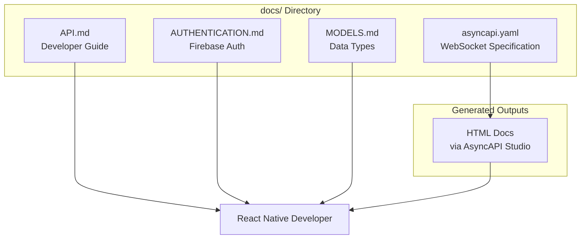

# SkiMate Backend API Documentation

## Documentation Architecture



## Files to Create

### 1. AsyncAPI Specification (`docs/asyncapi.yaml`)

Defines the WebSocket contract using AsyncAPI 3.0:

- **Servers**: Production (`wss://skimate-api-dev-uge4k3ygea-uc.a.run.app`) and Development
- **Channels**:
  - `/location` namespace with 4 client-to-server + 2 server-to-client events
  - `/chat` namespace with 5 client-to-server + 3 server-to-client events
- **Components/Schemas**: All message payload types (LocationPing, ChatMessage, etc.)
- **Security**: Firebase JWT authentication scheme

### 2. Main API Guide (`docs/API.md`)

Comprehensive developer guide covering:

- Quick start with connection setup
- Authentication flow (Firebase token retrieval + WebSocket handshake)
- Location tracking events with React Native examples
- Chat messaging events with React Native examples
- Error handling patterns
- Rate limiting (1 ping/second for location)

Key sections:

```markdown
## Quick Start
- Install socket.io-client
- Configure Firebase Auth
- Connect to WebSocket namespaces

## Location Tracking
- Starting/ending ski sessions
- Sending GPS pings
- Receiving friend location updates
- Proximity alerts

## Messaging
- Joining chat rooms
- Sending/receiving messages
- Typing indicators
- Read receipts
```

### 3. Authentication Guide (`docs/AUTHENTICATION.md`)

Firebase authentication details:

- How to get Firebase ID token in React Native
- WebSocket authentication handshake
- Token refresh strategy
- Error codes and handling

### 4. Data Models Reference (`docs/MODELS.md`)

TypeScript/JavaScript interfaces for all data types:

- User, UserPreferences
- LocationPing, LocationUpdate, ProximityAlert
- ChatMessage, Group, TypingIndicator
- SkiSession, SessionSummary
- Resort, Trail, Lift
- Enums (Gender, SkillLevel, TrailDifficulty, etc.)

## React Native Code Examples

Each section includes working code snippets:

```typescript
// Example: Sending location ping
socket.emit('location:ping', {
  sessionId: 'uuid',
  latitude: 46.8527,
  longitude: -121.7604,
  altitude: 1500,
  speed: 12.5,
  accuracy: 10,
  timestamp: Date.now()
});
```

## Deployment URL

Current production: `https://skimate-api-dev-uge4k3ygea-uc.a.run.app`

- Health check: `GET /health`
- Location WebSocket: `wss://skimate-api-dev-uge4k3ygea-uc.a.run.app/location`
- Chat WebSocket: `wss://skimate-api-dev-uge4k3ygea-uc.a.run.app/chat`

## Key Implementation Details from Codebase

### Location Gateway Events ([location.gateway.ts](src/modules/location/location.gateway.ts))

| Event | Direction | Description |

|-------|-----------|-------------|

| `location:ping` | client->server | Send GPS coordinates |

| `session:start` | client->server | Start ski session |

| `session:end` | client->server | End ski session |

| `location:subscribe` | client->server | Subscribe to friend updates |

| `location:update` | server->client | Receive friend location |

| `location:proximity` | server->client | Proximity alert (<100m) |

### Chat Gateway Events ([chat.gateway.ts](src/modules/chat/chat.gateway.ts))

| Event | Direction | Description |

|-------|-----------|-------------|

| `chat:join` | client->server | Join chat room |

| `chat:leave` | client->server | Leave chat room |

| `chat:send` | client->server | Send message |

| `chat:typing` | client->server | Typing indicator |

| `chat:read` | client->server | Read receipt |

| `chat:history` | client->server | Get message history |

| `chat:message` | server->client | Receive message |

| `chat:typing` | server->client | Receive typing status |

| `chat:read` | server->client | Receive read receipt |

## Package Dependencies for React Native

```json
{
  "socket.io-client": "^4.8.x",
  "@react-native-firebase/app": "latest",
  "@react-native-firebase/auth": "latest",
  "@react-native-community/geolocation": "latest"
}
```