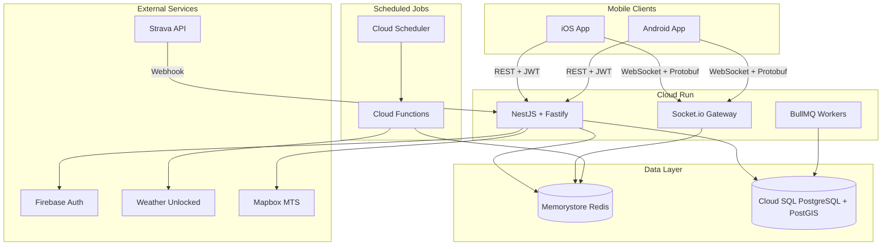

# SkiApp Backend Implementation Plan

## Architecture Overview



---

## Phase 1: Project Scaffolding and Infrastructure

### 1.1 NestJS Project Setup

- Initialize NestJS project with Fastify adapter
- Configure strict TypeScript (`strict: true`, no `any` types)
- Set up ESLint with `@typescript-eslint/recommended` and Prettier
- Configure Pino logger (Fastify default)
- Create folder structure:
  ```
  src/
    common/           # Guards, interceptors, filters, decorators
    config/           # ConfigModule with validation
    modules/
      auth/           # Firebase JWT verification
      users/          # User management
      location/       # Live tracking (Module A)
      chat/           # Messaging (Module B)
      resort/         # Resort integration (Module C)
    proto/            # Protocol Buffer definitions
  ```


### 1.2 Terraform Infrastructure

Create `terraform/` directory with:

- **Cloud SQL**: PostgreSQL 15 with PostGIS extension
- **Memorystore**: Redis 7.x instance
- **Cloud Run**: Service with session affinity, 3600s timeout
- **Secret Manager**: All API credentials (Strava, Mapbox, Weather Unlocked)
- **Cloud Scheduler + Functions**: Weather/lift polling jobs
- **IAM**: Service accounts with least-privilege access

### 1.3 Configuration Module

- NestJS ConfigModule with `class-validator` schemas
- Environment variables: `DB_HOST`, `DB_PORT`, `REDIS_URL`, `FIREBASE_PROJECT_ID`
- Secret Manager integration for production credentials
- `.env.example` with all required variables

---

## Phase 2: Database Schema and TypeORM Setup

### 2.1 TypeORM Configuration

- Configure TypeORM with PostGIS support
- Set `synchronize: false` (migrations only)
- Enable query logging in development
- Configure SSL for production Cloud SQL

### 2.2 Entity Definitions

Create entities in `src/modules/*/entities/`:

| Entity | Key Features |

|--------|-------------|

| `User` | UUID PK (Firebase UID), relations to preferences/sessions/groups |

| `UserPreferences` | JSONB notification settings, units enum |

| `Friendship` | Composite indexes on `userId1 + status`, `userId2 + status` |

| `Group` | ManyToMany with users via `group_members` join table |

| `Message` | Indexes on `groupId + sentAt`, `recipientId + senderId + sentAt` |

| `Resort` | Geography Polygon for boundary, GIST spatial index |

| `Trail` | Geography LineString for path, difficulty enum, status enum |

| `Lift` | LiftType and LiftStatus enums |

| `SkiSession` | Relations to user, resort, location pings |

| `LocationPing` | Geography Point, GIST spatial index, partitioned by date |

### 2.3 Migrations

1. `EnablePostGIS` - Create PostGIS extension
2. `CreateEnums` - All enum types
3. `CreateUserTables` - users, user_preferences
4. `CreateSocialTables` - friendships, groups, group_members, messages
5. `CreateResortTables` - resorts, trails, lifts
6. `CreateTrackingTables` - ski_sessions, location_pings with partitioning
7. `CreateSpatialIndexes` - GIST indexes on all geography columns

---

## Phase 3: Module A - Live Tracking

### 3.1 Firebase Auth Guard

- Create `FirebaseAuthGuard` using Firebase Admin SDK
- Extract and verify JWT from `Authorization` header
- Attach decoded user to request context
- Apply globally via `APP_GUARD`

### 3.2 Protocol Buffers Setup

Define `src/proto/location.proto`:

```protobuf
message LocationPing {
  string user_id = 1;
  double latitude = 2;
  double longitude = 3;
  double altitude = 4;
  double speed = 5;
  double accuracy = 6;
  int64 timestamp = 7;
}
```

- Use `protobufjs` for serialization/deserialization
- Configure Fastify content parser for binary payloads

### 3.3 WebSocket Gateway

`src/modules/location/location.gateway.ts`:

- Socket.io with Redis adapter (`@socket.io/redis-adapter`)
- Handle `location:ping` events with Protobuf payloads
- Implement `ThrottlingInterceptor` (1 ping/second max)
- Track connections in Redis Set: `connections:{userId}`

### 3.4 Location Service

`src/modules/location/location.service.ts`:

- **Redis GEOADD**: Store live coordinates in `resort:{resortId}:active_users`
- **TTL Management**: 5-minute expiry on inactive users
- **Proximity Detection**: GEORADIUSBYMEMBER within 500m radius
- **Selective Broadcast**: Emit only to nearby friends' sockets

### 3.5 Persistence Worker

- BullMQ queue: `location-pings`
- Batch insert to `location_pings` table (100 pings per batch)
- TypeORM repository with WKT point format

### 3.6 Geofencing Service

- Resort boundary check using ST_Within
- TypeORM query builder with PostGIS functions
- Detect resort entry/exit events

---

## Phase 4: Module B - Messaging

### 4.1 Chat Gateway

`src/modules/chat/chat.gateway.ts`:

- Socket.io rooms: `group:{groupId}` or `dm:{sortedUserIds}`
- Events: `message:send`, `message:typing`, `message:read`
- Instant broadcast via `socket.to(room).emit()`

### 4.2 Redis State Management

- **Typing indicators**: `typing:{groupId}:{userId}` with 5s TTL
- **Message cache**: `chat:{groupId}:messages` (LPUSH + LTRIM 50)
- **Online status**: `online:{userId}` with heartbeat TTL

### 4.3 Write-Behind Persistence

1. Push to Redis List immediately
2. Emit to WebSocket room
3. Add to BullMQ `chat-persistence` queue
4. Worker batch inserts to `messages` table

### 4.4 Group Service

- CRUD operations using TypeORM relations
- Add/remove members with proper authorization
- Query with `leftJoinAndSelect` for members

### 4.5 Midpoint Calculation

`src/modules/chat/geometric.service.ts`:

- Fetch latest location pings for group members
- Use `@turf/center` for centroid calculation
- Find nearest trail/facility using ST_Distance

---

## Phase 5: Module C - Resort Integration

### 5.1 Resort Service

- CRUD for resorts, trails, lifts using TypeORM
- Eager loading with relations
- GeoJSON export for Mapbox integration

### 5.2 Weather Polling (Cloud Function)

`cloud-functions/weather-polling/`:

- Triggered by Cloud Scheduler every 15 minutes
- Fetch from Weather Unlocked API
- Store in Redis: `weather:{resortId}` with 15-min TTL
- Optional PostgreSQL persistence for historical data

### 5.3 Lift Status Updates

- Similar Cloud Function pattern (every 10 minutes)
- Redis key: `lift_status:{resortId}`
- TypeORM bulk update for PostgreSQL sync

### 5.4 Mapbox Service

`src/modules/resort/mapbox.service.ts`:

- Convert trails to GeoJSON FeatureCollection
- Push to Mapbox Tilesets API on status change
- Use ST_Simplify for geometry optimization

### 5.5 Strava Webhook

`src/modules/resort/strava.controller.ts`:

- GET `/webhooks/strava`: Challenge-response handshake
- POST `/webhooks/strava`: Activity event processing
- Signature verification using Client Secret
- Create `ski_sessions` from activity data

---

## Phase 6: Testing and Deployment

### 6.1 Unit Tests

- Jest with TypeORM repository mocks
- `ioredis-mock` for Redis testing
- 80%+ coverage target per module

### 6.2 Integration Tests

- Test database with PostGIS enabled
- Socket.io client for WebSocket flows
- Strava webhook handshake verification

### 6.3 Load Testing

- Artillery/k6 for 1000 concurrent GPS pings
- Target: 95th percentile latency less than 150ms

### 6.4 Deployment

1. `terraform apply` for infrastructure
2. Run TypeORM migrations
3. Deploy Cloud Functions
4. Deploy Cloud Run service
5. Verify Strava webhook registration

---

## Key Files to Create

| Path | Purpose |

|------|---------|

| [`src/main.ts`](src/main.ts) | Fastify adapter, PORT env, Pino logger |

| [`src/app.module.ts`](src/app.module.ts) | Root module with TypeORM, Redis, Config |

| [`src/common/guards/firebase-auth.guard.ts`](src/common/guards/firebase-auth.guard.ts) | JWT verification |

| [`src/modules/location/location.gateway.ts`](src/modules/location/location.gateway.ts) | WebSocket GPS ingestion |

| [`src/modules/chat/chat.gateway.ts`](src/modules/chat/chat.gateway.ts) | Real-time messaging |

| [`terraform/main.tf`](terraform/main.tf) | GCP infrastructure |

| [`ROADMAP.md`](ROADMAP.md) | Detailed implementation checklist |

---

## Success Criteria Summary

- Zero TypeScript `any` types
- All DB operations via TypeORM (no raw SQL except in query builder)
- `terraform plan` executes without errors
- WebSocket survives 60s idle
- GPS ping to Redis less than 100ms
- 95th percentile API response less than 50ms
- Strava webhook responds in less than 2s